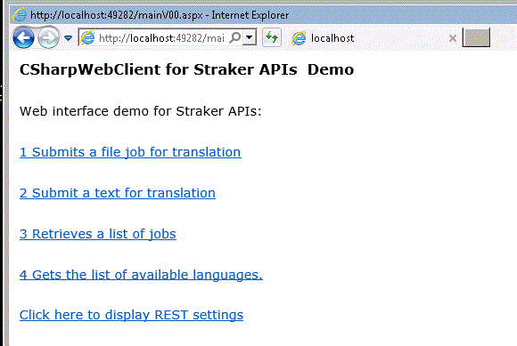
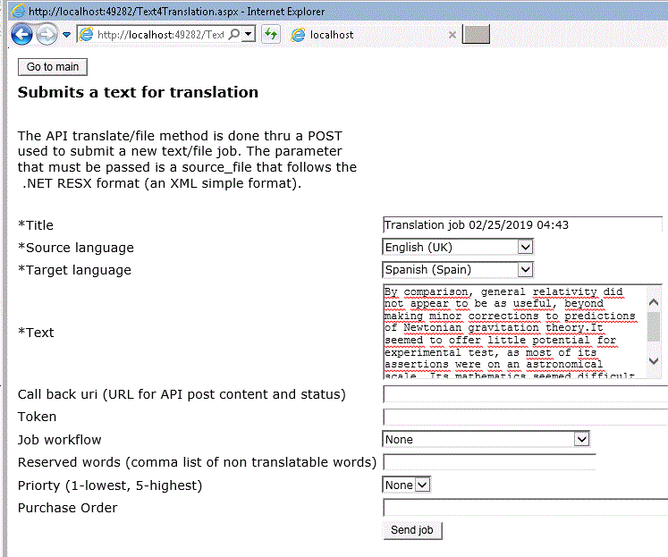
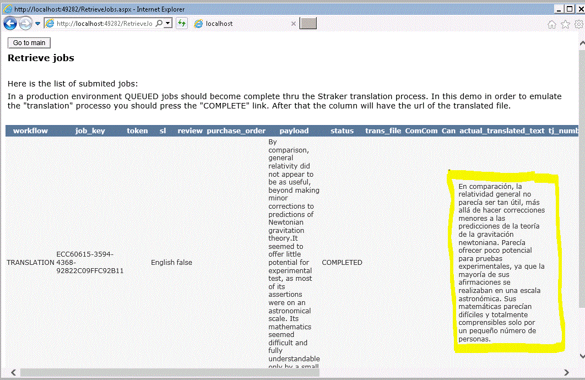

# 1 CSharpWebClient for Straker APIs Demo

The CSharpWebClient for Straker APIs Demo is a set of apsx pages using C# code behind and developed on Microsoft VS 2017 Community Edition (freely available). These pages provide an interface to the [Straker Translation API](https://help.strakertranslations.com/hc/en-us/categories/115000412453-stingRAY-Translation-API). [Straker Translations](https://www.strakertranslations.com) provides a Sandbox environment to run these API. The purpose of the site is to test these APIs. APIs can be called from any C# flavor (and obviously from other languages).

You can find a live demo in [http://213.97.57.158/CSharpWebClient/mainV00.aspx](http://213.97.57.158/CSharpWebClient/mainV00.aspx). I cannot guarantee any level of service as this a private site and the API or the Straker policy service can change. There are the following options:

 

## 1.1 Submits a file job for translation / 1.2 Submit a text for translation 

The options 1 and 2 allow you to send a .RESX XML file or a plain text. The API will create a job to be processed inside Straker translation services. In a real environment the job will be "COMPLETE" once the file is translated in Straker premises. In the demo we have to "COMPLETE" the jobs manually in the job list. The returned file will be returned translated if the source/target pair exists.

## 1.3 Retrieves a list of jobs

This option displays the job files sent. Also here you will be able to manually "COMPLETE" your jobs, and after that you will be able to display/download the translation.

## 1.4 Get a list of available languages

This page will show the list of available languages. Remember this is a demo, so many of these pairs will produce no translation.

## 1.5 Quick Guide

- You need a token from Straker in order to call the Sandbox. You can use the default values o get your on token [here](https://help.strakertranslations.com/hc/en-us/articles/115004055314-Getting-Started). You only need to provide a email to receive it.
- Select option **2 Submit a text for translation** to input a flat text and the translation options.
 
- Select the option **3 Retrieves a list of jobs** to COMPLETE the job. (In a real environment this will happen once the translation is done).
- The translation text or file will be in the list of jobs.
-  

## 2 Additional information and notes
- The main help entry is in [Straker Translation Automation](https://www.strakertranslations.com/service/api/).
- The main API help entry is in [stringRay Translation API](https://help.strakertranslations.com/hc/en-us/categories/115000412453-API).
- In order to read more about the job flow, read [How it Works](https://help.strakertranslations.com/hc/en-us/articles/115004055334-How-it-Works)                                                    
- These pages do not use any API async feature and for clarity sake do not have any error verification.

## 3 MIT License 
- Source code is available in [https://github.com/miguelknals/APIStrakerV00](https://github.com/miguelknals/APIStrakerV00) under a MIT License.
- Feel free to contact me if you want miguelknals at gmail dot com or [www.mknals.com](http://www.mknals.com).